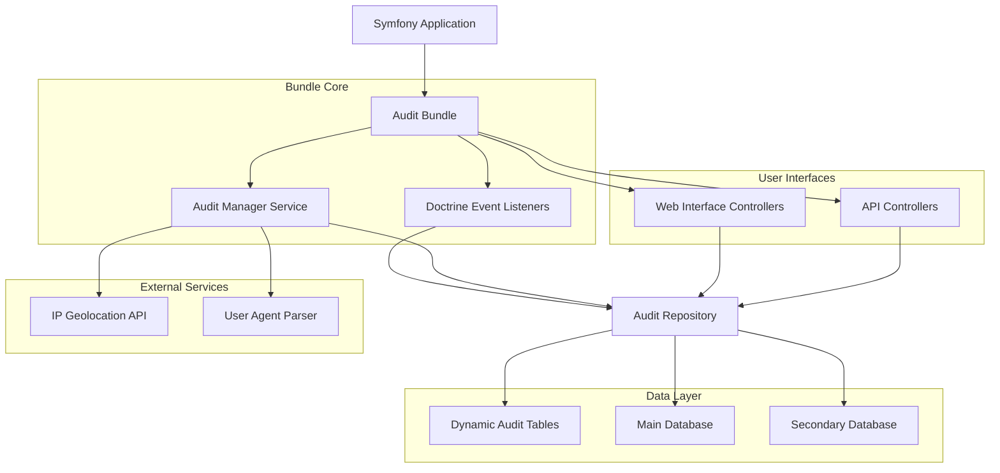
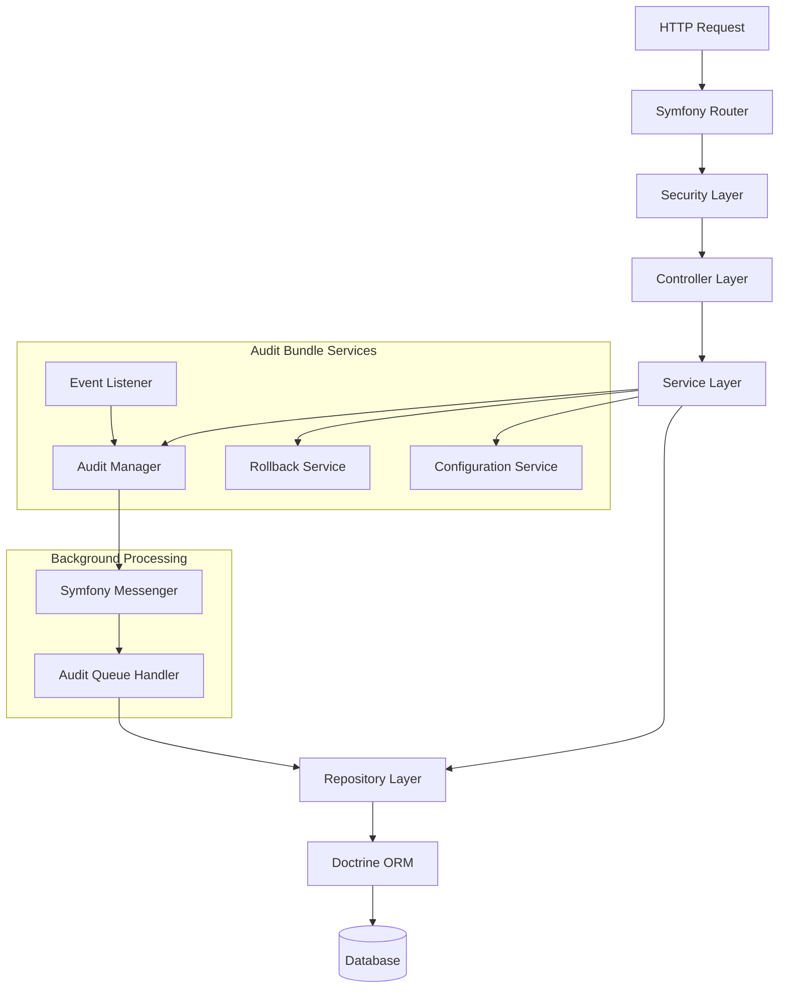
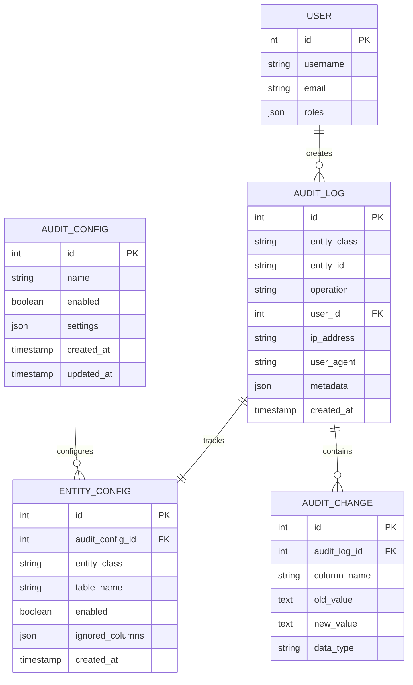

# Symfony Audit Bundle - Technical Architecture Document

## 1. Architecture Design



## 2. Technology Description

- **Backend**: Symfony 6.0+ with PHP 8.2+
- **ORM**: Doctrine ORM for entity management and dynamic table creation
- **Frontend**: Twig templates with Bootstrap 5 and Alpine.js for interactivity
- **Database**: PostgreSQL/MySQL with dynamic audit table creation
- **API**: Symfony API Platform for RESTful endpoints
- **Security**: Symfony Security component for role-based access control
- **Additional**: Symfony Messenger for async processing, Redis for caching

## 3. Route Definitions

| Route | Purpose |
|-------|----------|
| /audit | Audit dashboard with overview statistics |
| /audit/logs | Entity audit logs listing with pagination |
| /audit/logs/{id} | Detailed view of specific audit entry |
| /audit/config | Configuration management interface |
| /audit/rollback | Data rollback interface |
| /audit/api/docs | API documentation and testing interface |
| /api/audit/entities | API endpoint for entity audit data |
| /api/audit/changes/{id} | API endpoint for specific change details |
| /api/audit/rollback | API endpoint for rollback operations |

## 4. API Definitions

### 4.1 Core API

**Get Audit Logs**
```
GET /api/audit/entities
```

Request Parameters:
| Param Name | Param Type | isRequired | Description |
|------------|------------|------------|-------------|
| entity | string | false | Filter by entity class name |
| operation | string | false | Filter by operation (insert/update/delete) |
| user_id | integer | false | Filter by user ID |
| date_from | string | false | Start date (ISO 8601 format) |
| date_to | string | false | End date (ISO 8601 format) |
| page | integer | false | Page number for pagination |
| limit | integer | false | Items per page (max 100) |

Response:
| Param Name | Param Type | Description |
|------------|------------|-------------|
| data | array | Array of audit log entries |
| meta | object | Pagination metadata |
| total | integer | Total number of records |

Example Response:
```json
{
  "data": [
    {
      "id": 123,
      "entity_class": "App\\Entity\\User",
      "entity_id": "456",
      "operation": "update",
      "user_id": 789,
      "ip_address": "192.168.1.1",
      "user_agent": "Mozilla/5.0...",
      "changes": {
        "email": {
          "old": "old@example.com",
          "new": "new@example.com"
        }
      },
      "created_at": "2024-01-15T10:30:00Z"
    }
  ],
  "meta": {
    "page": 1,
    "limit": 20,
    "total": 150
  }
}
```

**Rollback Operation**
```
POST /api/audit/rollback
```

Request:
| Param Name | Param Type | isRequired | Description |
|------------|------------|------------|-------------|
| audit_ids | array | true | Array of audit log IDs to rollback |
| confirm | boolean | true | Confirmation flag |

Response:
| Param Name | Param Type | Description |
|------------|------------|-------------|
| success | boolean | Operation success status |
| rolled_back | integer | Number of entities rolled back |
| errors | array | Any errors encountered |

## 5. Server Architecture Diagram



## 6. Data Model

### 6.1 Data Model Definition



### 6.2 Data Definition Language

**Audit Configuration Table**
```sql
-- Main audit configuration
CREATE TABLE audit_config (
    id SERIAL PRIMARY KEY,
    name VARCHAR(255) NOT NULL UNIQUE,
    enabled BOOLEAN DEFAULT true,
    settings JSON,
    created_at TIMESTAMP WITH TIME ZONE DEFAULT NOW(),
    updated_at TIMESTAMP WITH TIME ZONE DEFAULT NOW()
);

-- Entity-specific configuration
CREATE TABLE audit_entity_config (
    id SERIAL PRIMARY KEY,
    audit_config_id INTEGER REFERENCES audit_config(id) ON DELETE CASCADE,
    entity_class VARCHAR(500) NOT NULL,
    table_name VARCHAR(255) NOT NULL,
    enabled BOOLEAN DEFAULT true,
    ignored_columns JSON DEFAULT '[]',
    created_at TIMESTAMP WITH TIME ZONE DEFAULT NOW(),
    UNIQUE(audit_config_id, entity_class)
);

-- Main audit log table
CREATE TABLE audit_log (
    id BIGSERIAL PRIMARY KEY,
    entity_class VARCHAR(500) NOT NULL,
    entity_id VARCHAR(255) NOT NULL,
    operation VARCHAR(20) NOT NULL CHECK (operation IN ('insert', 'update', 'delete')),
    user_id INTEGER,
    ip_address INET,
    user_agent TEXT,
    metadata JSON DEFAULT '{}',
    created_at TIMESTAMP WITH TIME ZONE DEFAULT NOW()
);

-- Detailed changes table
CREATE TABLE audit_change (
    id BIGSERIAL PRIMARY KEY,
    audit_log_id BIGINT REFERENCES audit_log(id) ON DELETE CASCADE,
    column_name VARCHAR(255) NOT NULL,
    old_value TEXT,
    new_value TEXT,
    data_type VARCHAR(50)
);

-- Indexes for performance
CREATE INDEX idx_audit_log_entity ON audit_log(entity_class, entity_id);
CREATE INDEX idx_audit_log_user ON audit_log(user_id);
CREATE INDEX idx_audit_log_created ON audit_log(created_at DESC);
CREATE INDEX idx_audit_log_operation ON audit_log(operation);
CREATE INDEX idx_audit_change_log_id ON audit_change(audit_log_id);
CREATE INDEX idx_audit_change_column ON audit_change(column_name);

-- Initial configuration data
INSERT INTO audit_config (name, enabled, settings) VALUES 
('default', true, '{"retention_days": 365, "async_processing": true}');

-- Example entity configuration
INSERT INTO audit_entity_config (audit_config_id, entity_class, table_name, enabled, ignored_columns) VALUES 
(1, 'App\\Entity\\User', 'users', true, '["password", "salt", "token"]'),
(1, 'App\\Entity\\Product', 'products', true, '[]'),
(1, 'App\\Entity\\Order', 'orders', true, '["internal_notes"]');
```

**Dynamic Audit Tables (Created per Entity)**
```sql
-- Example: User entity audit table (auto-generated)
CREATE TABLE audit_user (
    id BIGSERIAL PRIMARY KEY,
    audit_log_id BIGINT REFERENCES audit_log(id) ON DELETE CASCADE,
    entity_id INTEGER NOT NULL,
    operation VARCHAR(20) NOT NULL,
    -- Original entity columns for snapshot
    username VARCHAR(255),
    email VARCHAR(255),
    first_name VARCHAR(255),
    last_name VARCHAR(255),
    created_at TIMESTAMP WITH TIME ZONE,
    updated_at TIMESTAMP WITH TIME ZONE,
    -- Audit metadata
    audit_created_at TIMESTAMP WITH TIME ZONE DEFAULT NOW()
);

CREATE INDEX idx_audit_user_entity_id ON audit_user(entity_id);
CREATE INDEX idx_audit_user_operation ON audit_user(operation);
```
