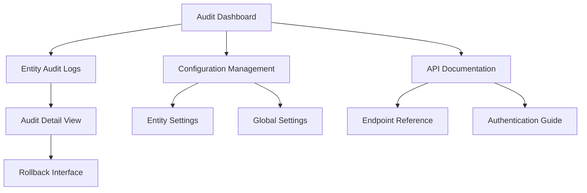

# Symfony Audit Bundle - Product Requirements Document

## 1. Product Overview
A comprehensive Symfony bundle that automatically tracks and logs all entity changes (insert, update, delete) in your application with a user-friendly web interface for viewing audit logs.

The bundle provides developers and administrators with complete visibility into data modifications, including who made changes, when they occurred, and what the previous values were. It supports role-based access control, API access, and data rollback functionality for enterprise-grade audit requirements.

## 2. Core Features

### 2.1 User Roles
| Role | Registration Method | Core Permissions |
|------|---------------------|------------------|
| Admin | Symfony security configuration | Full access to all audit logs, configuration management, rollback operations |
| Auditor | Role assignment by Admin | Read-only access to audit logs, export capabilities |
| Developer | Role assignment by Admin | Access to specific entity audit logs, API access |
| Regular User | Standard application user | No audit access (configurable per application) |

### 2.2 Feature Module
Our Symfony audit bundle consists of the following main pages:
1. **Audit Dashboard**: overview statistics, recent changes summary, quick filters.
2. **Entity Audit Logs**: detailed audit log listing, advanced filtering, pagination.
3. **Audit Detail View**: complete change details, old vs new values comparison, metadata.
4. **Configuration Management**: entity inclusion/exclusion settings, column filtering options.
5. **Rollback Interface**: data restoration tools, rollback confirmation, batch operations.
6. **API Documentation**: endpoint reference, authentication guide, usage examples.

### 2.3 Page Details
| Page Name | Module Name | Feature description |
|-----------|-------------|---------------------|
| Audit Dashboard | Statistics Panel | Display total changes count, changes by entity type, recent activity timeline |
| Audit Dashboard | Quick Filters | Filter by date range, entity type, operation type (insert/update/delete) |
| Audit Dashboard | Recent Changes | Show last 10 modifications with entity name, operation, user, timestamp |
| Entity Audit Logs | Audit Log Table | Display paginated list with entity, operation, user, IP, timestamp, changes count |
| Entity Audit Logs | Advanced Filters | Filter by entity type, date range, user, IP address, operation type |
| Entity Audit Logs | Export Functions | Export filtered results to CSV, JSON, Excel formats |
| Audit Detail View | Change Comparison | Side-by-side view of old and new values with highlighted differences |
| Audit Detail View | Metadata Display | Show user info, IP address, timestamp, user agent, session details |
| Audit Detail View | Related Changes | Display other changes made in same transaction or session |
| Configuration Management | Entity Settings | Enable/disable auditing per entity, configure ignored columns |
| Configuration Management | Global Settings | Set retention period, configure database connections, API settings |
| Rollback Interface | Change Selection | Select specific changes or date ranges for rollback operations |
| Rollback Interface | Preview Mode | Show what will be restored before confirming rollback |
| Rollback Interface | Batch Operations | Rollback multiple entities or entire transactions at once |
| API Documentation | Endpoint Reference | List all available API endpoints with parameters and response formats |
| API Documentation | Authentication Guide | Explain API key generation, token-based auth, rate limiting |

## 3. Core Process

**Admin Flow:**
1. Admin accesses audit dashboard to view system-wide changes
2. Uses advanced filters to find specific modifications
3. Reviews detailed change information and metadata
4. Configures which entities and columns to audit
5. Performs rollback operations when needed
6. Manages user access and API keys

**Auditor Flow:**
1. Auditor logs into audit interface with read-only permissions
2. Searches and filters audit logs by various criteria
3. Views detailed change information and exports reports
4. Monitors compliance and generates audit reports

**Developer Flow:**
1. Developer accesses API documentation and generates API keys
2. Integrates audit API into applications or monitoring tools
3. Queries audit data programmatically for specific entities
4. Uses webhook notifications for real-time change monitoring

## 4. User Interface Design

### 4.1 Design Style
- **Primary Colors**: Deep blue (#2563eb) for headers and primary actions, light blue (#dbeafe) for backgrounds
- **Secondary Colors**: Gray (#6b7280) for text, green (#10b981) for success states, red (#ef4444) for deletions
- **Button Style**: Rounded corners (8px), subtle shadows, hover animations
- **Font**: Inter or system fonts, 14px base size, 16px for headings
- **Layout Style**: Clean card-based design with consistent spacing, top navigation with breadcrumbs
- **Icons**: Heroicons or Feather icons for consistency, audit-specific icons for operations

### 4.2 Page Design Overview
| Page Name | Module Name | UI Elements |
|-----------|-------------|-------------|
| Audit Dashboard | Statistics Panel | Large number cards with icons, color-coded by operation type, animated counters |
| Audit Dashboard | Quick Filters | Horizontal filter bar with dropdowns, date pickers, clear filters button |
| Entity Audit Logs | Audit Log Table | Striped table with sortable columns, row hover effects, operation type badges |
| Entity Audit Logs | Advanced Filters | Collapsible filter panel, multi-select dropdowns, date range pickers |
| Audit Detail View | Change Comparison | Split-pane layout with syntax highlighting, diff-style color coding |
| Configuration Management | Entity Settings | Toggle switches for entities, multi-select for columns, save confirmation |
| Rollback Interface | Change Selection | Checkbox selection, bulk action toolbar, confirmation modals |

### 4.3 Responsiveness
The interface is desktop-first with mobile-adaptive design. Touch-friendly controls are optimized for tablet use, with collapsible navigation and responsive tables that stack on smaller screens.
